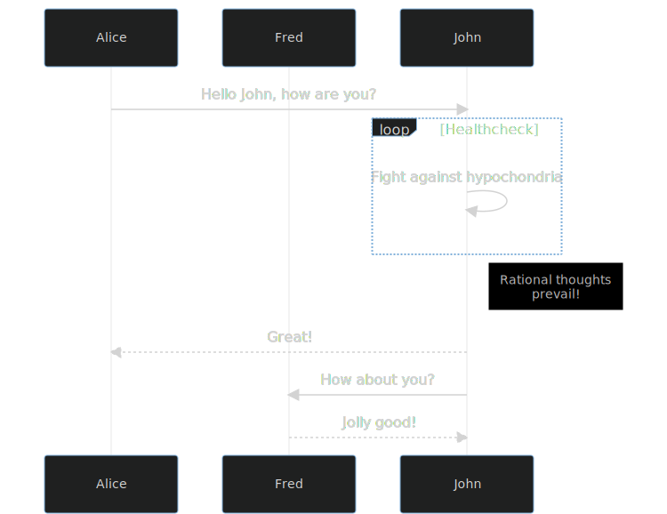

# mermaid-markdown-intree
Github [doesn't support mermaid for markdown files](https://github.community/t/feature-request-support-mermaid-markdown-graph-diagrams-in-md-files/1922). This is annoying if you want in-tree diagrams for documentation in markdown files.

This repository aims to work around this issue. The setup here is:

1. Have a file `sequence.mmd` in the repo.
1. Setup the mermaid cli and husky in the repo in `package.json` and `yarn.lock`.
1. Run `husky install` to setup husky hooks
1. Setup a script `precommit.sh` that will generate an `.svg` file from the `.mmd` file if there are changes to the .svg file
1. Configure a precommit hook that runs `precommit.sh` with husky.
1. Include the generated file in your markdown.

## End result

